# CMPE 172 - Lab #10 Notes

In this lab, we experiment with CI/CD through GitHub Actions.

## CI

In this portion of the lab, we set up an action to test and build a Gradle-based
project. For this specific action, we trigger it to run on pushes and PRs to
`main`.

The specific action can be found in `.github/gradle.yml`.

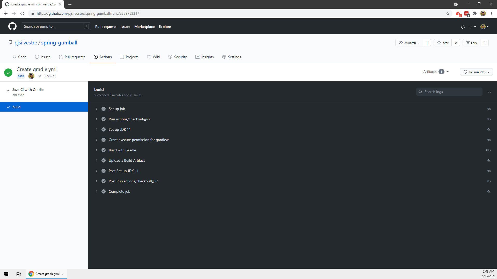

## CD

In this portion of the lab, we set up an action to build a Gradle-based project
and deploy it to GKE.

The specific action can be found in `github/google.yml`.

Before any work, we need to create a service account to allow GitHub to access
our cluster:

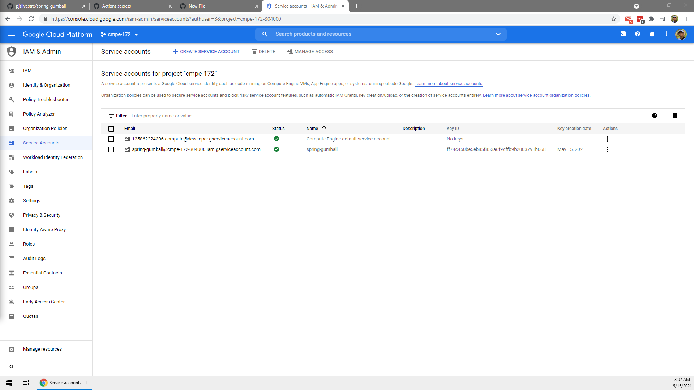

Then, with details based on our project and the newly made account, we add
secrets at the repo level:

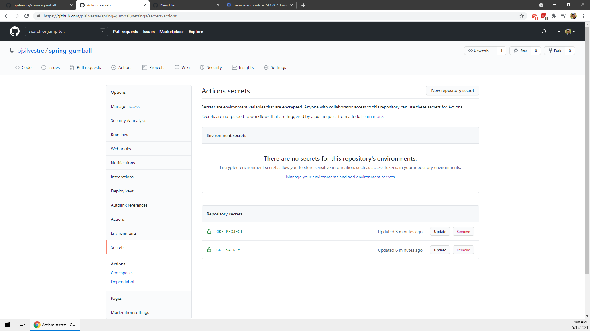

Next, we spin up our cluster:

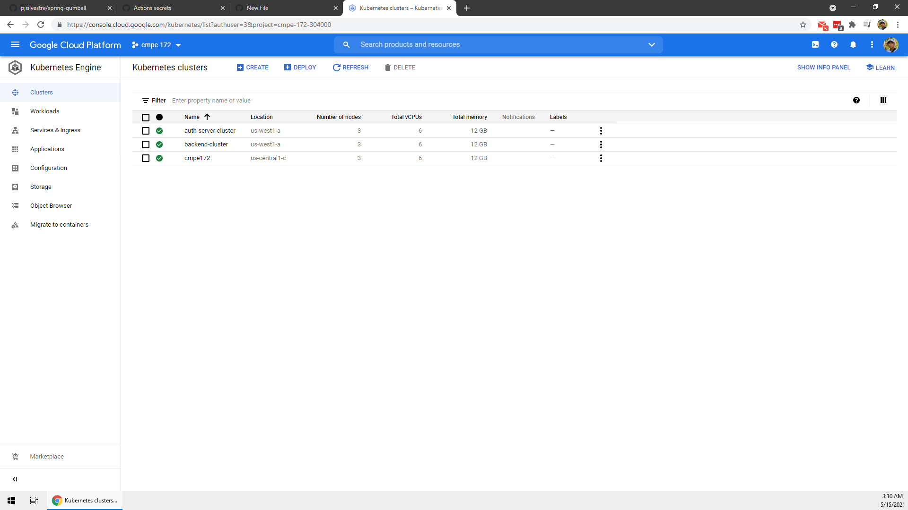

At first, I was having trouble getting my build to pass:

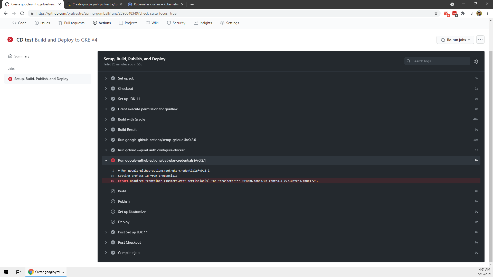

After some googling, I thought my issue was the service account, so I deleted it
and created a new one, this time with owner-level permissions:

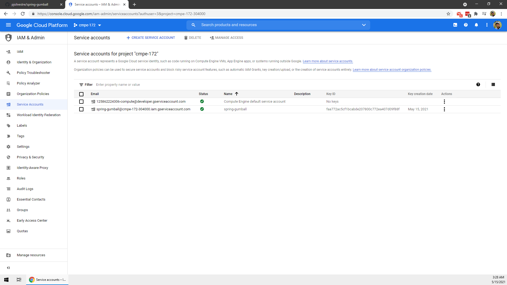

Then, my build failed, but this time, for a different reason! (Progress!)

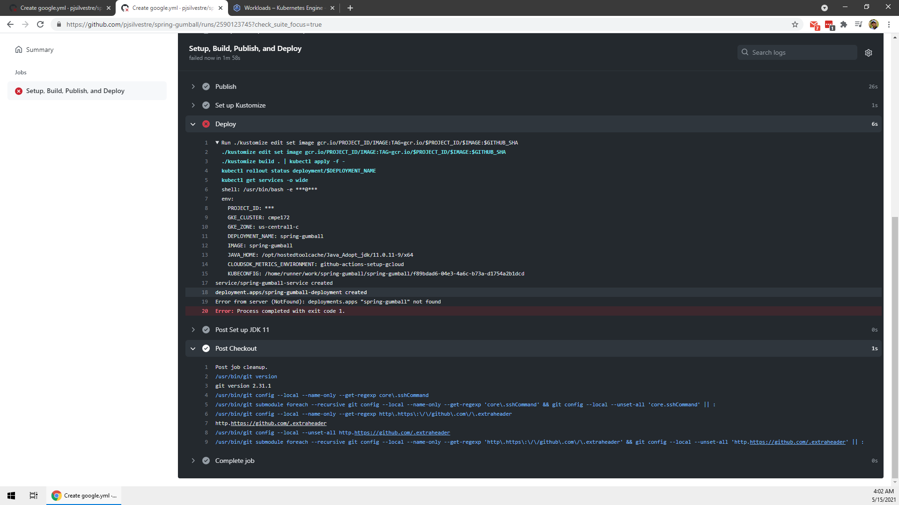

To fix it, I corrected the name of the deployment (from
`spring-gumball` to `spring-gumball-deployment`), and my build finally passed:

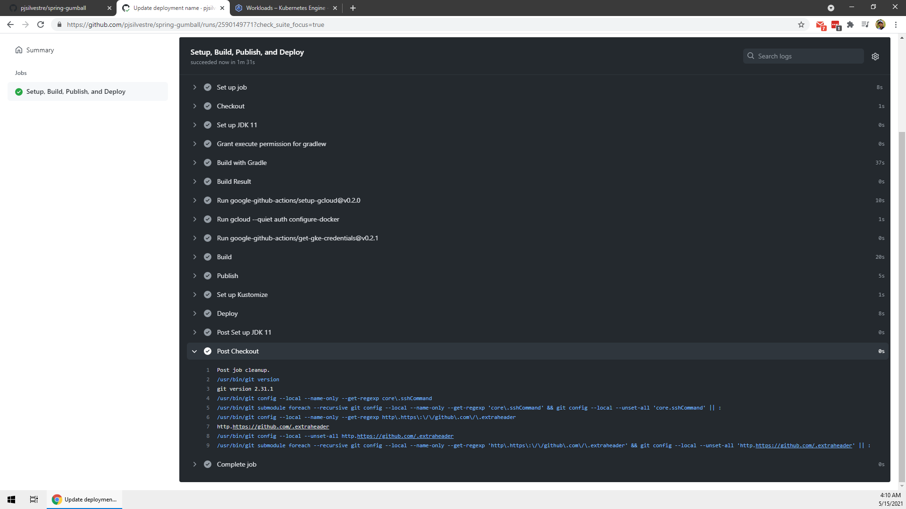

To verify, I checked out my workloads and services/ingress:

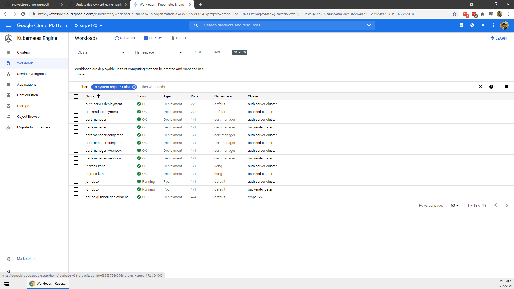

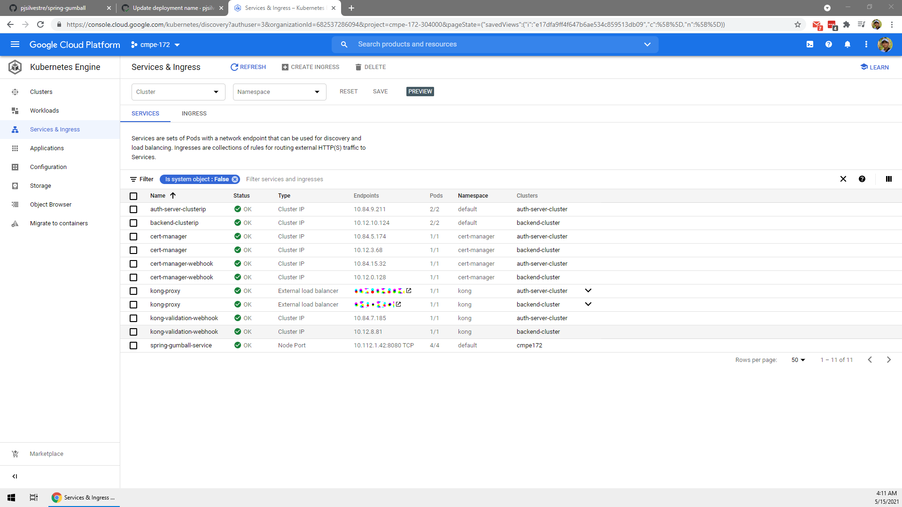

I then set up a ingress for `spring-gumball-service`:

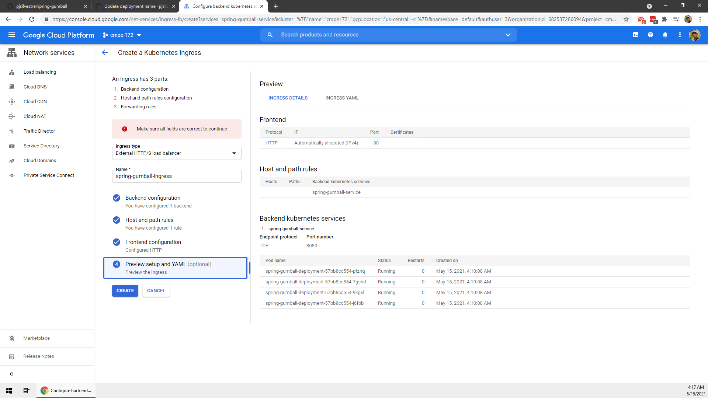

Then, I verified that I could reach the service:

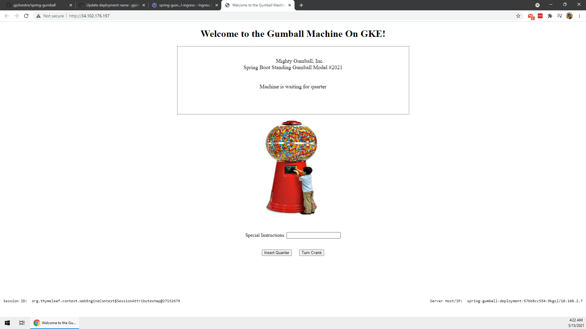

Awesome!